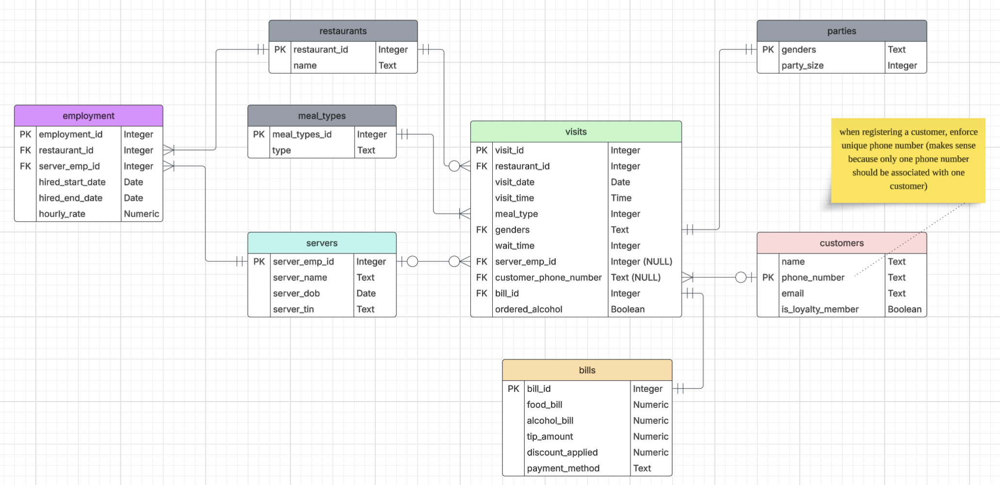

## List of Functional Dependencies
### Primary Key Depedencies
* visitID $\rightarrow$ { all attributes }

### Dependencies Related to Servers
* ServerEmpID $\rightarrow$ { ServerName, StartDateHired, ServerBirthDate, ServerTIN }
* ServerTIN $\rightarrow$ { ServerName, StartDateHired, ServerBirthDate, ServerEmpID }

### Dependencies Related to Customers 
* CustomerName $\rightarrow$ { CustomerPhone, CustomerEmail, LoyaltyMember }
* CustomerPhone $\rightarrow$ { CustomerName, CustomerEmail, LoyaltyMember }
* CustomerEmail $\rightarrow$ { CustomerName, CustomerPhone, LoyaltyMember }
* Genders $\rightarrow$ PartySize

### Dependencies Related to Bills
* DiscountApplied $\rightarrow$ LoyaltyMember
* AlcoholBill $\rightarrow$ orderedAlcohol

---

## Decomposed Relations
### Servers
ServerEmpID $\rightarrow$ { ServerName, StartDateHired, ServerBirthDate, ServerTIN }

### Visits
VisitID $\rightarrow$ { Restaurant, VisitDate, VisitTime, MealType, Genders, WaitTime, ServerEmpID, CustomerPhoneNumber, OrderedAlcohol, BillID}

### Bills
BillID $\rightarrow$ { FoodBill, AlcoholBill, TipAmount, DiscountApplied, PaymentMethod }

### Customers
CustomerPhoneNumber $\rightarrow$ { CustomerName, CustomerPhoneNumber, CustomerEmail, LoyaltyMember }

### Parties
Genders $\rightarrow$ PartySize

---

## ERD of Normalized Relations
** Todo: replace image with the one in AWS server **
{width=50%}
